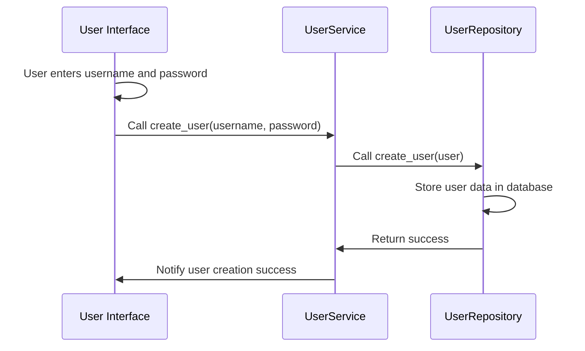

## Class Diagram

## Sequence Diagram for create user functionality

```mermaid
sequenceDiagram
    participant UI as User Interface
    participant US as UserService
    participant UR as UserRepository

    UI->>UI: User enters username and password
    UI->>US: Call create_user(username, password)
    US->>UR: Call create_user(user)
    UR->>UR: Store user data in database
    UR->>US: Return success
    US->>UI: Notify user creation success
```

