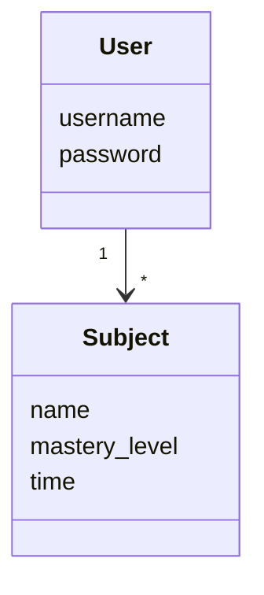
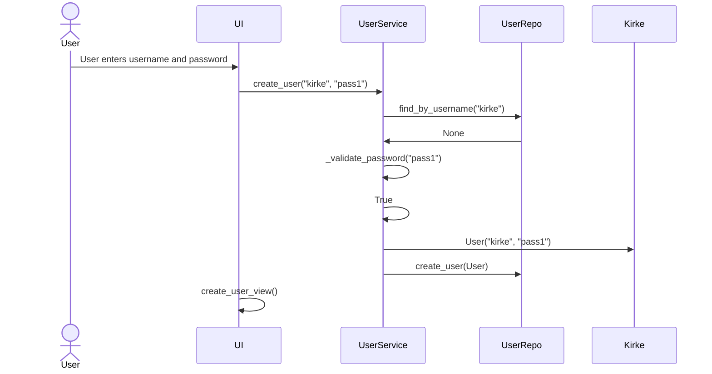
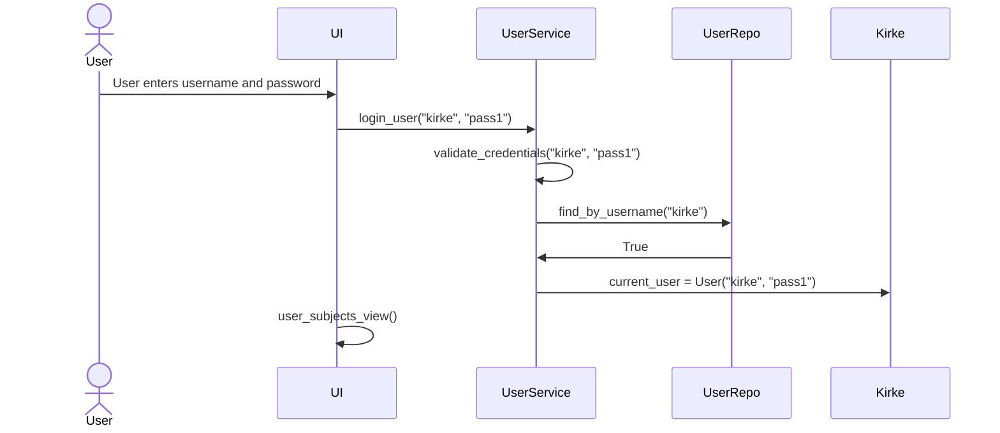
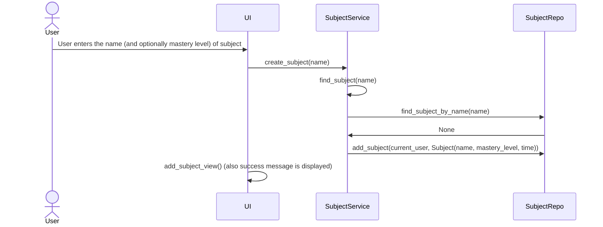
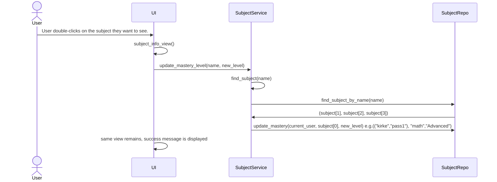

## Structure of the application

The following package diagram shows the general architecture of the application.

## User Interface
The UI has 7 views:
1. Login
2. Create account
3. Main page
4. View subjects
5. Add subject
6. Subject overview
7. Visualize subjects

These views all have their own classes, only one can be viewed at a time. There is a view manager that manages switching between the views. All of the UI is in it's own directory, separate from the application logic.

## Application logic
Under the directory Entities, there are the two classes that make up the base of the application: User and Subject.

Under the directory Repositories are the classes that handle interactions with the database: UserRepository and SubjectRepository. These classes provide methods for the application to interact with the database, ensuring a separation between application logic and database, as well as between the UI.

Under the directory Services are the classes that handle the main application logic: UserService and SubjectService. These classes provide methods that are used to manage the overall logic behind the user interacting with the app. The UserService class makes use of the UserRepository class to interact with the database when it comes to creations of users, logging in/out etc. The SubjectService makes use of the SubjectRepository class to interact with the database (adding, removing, viewing, editing subjects).

Here is a package diagram showing how the repositories and services work.

## Storage of data
As mentioned earlier, the UserRepository and SubjectRepository handle data storage and interaction with the database. The database in use in my application is the SQLite database, and it has two tables (for User and Subject).
As one would expect, the users table holds in it all of the info about the user (with username and password as attributes). The subjects table holds in it all the info about the subjects (with id, username, name, mastery_level, time as attributes).

## Functionalities
The main functionalities are:

### Creating a user:
The user first from the main screen click on create user button. Then they are taken to a view, where they must input a username and a password. Here is the sequence diagram:

Sequence Diagram 

### Logging in a user:
Works very similarly to the create user. The user has to enter their credentials, and if they are correct, the user will be logged in and directed to a view of their subjects.

Sequence Diagram

### Viewing subjects:
Once the user has added a subject, they can either add another one, or click back to navigate to view of all subjects. This view is quite straight-forward, so a sequence diagram is not needed. This is the first view that shows up for the user once they have logged in. From here they can:
1. Click on add subject. Then the UI switches view into add_subject_view, that is described next in this file.
2. Double-click on a subject. Then the UI switches view into subject_info_view, which is also described later.
3. Click on visualize your subjects. Then the UI switches view into time_spent_view, which is described later.
4. Click on log out. Then the UI switches view into the first_view, which is simply the main screen where the user can either create an account or log into an existing one.

### Creating a new subject:
If user clicks on add subject, they will be directed to a screen where they can input the name and mastery level of a subject. When they click on submit, the UI calls the create_subject method from the SubjectService, giving it the name and mastery level as parameters. The create_subject method then makes sure that the subject name is not empty and a subject with the same name does not already exist. If that has been verified, then it calls the add_subject method from the SubjectRepository. That method will add a subject with the name and mastery level into the database, and the user will be given feedback of success (or failure if something was wrong at any step).

Sequence Diagram

### Subject Overview/Edit:
If user enters the subject overview/edit view, they can see the mastery level and time logged for the subject. In this screen they can change these two, or they can choose to delete the subject. The following sequence diagram shows the functionality of updating mastery level.

Sequence Diagram

### Other functionalities
1. The user can visualize their subjects, this uses matplotlib. A plot of time spent studying against subject names will be displayed, the plotting all happens in the user interface. In order to fetch the subjects, the UI calls the find_user_subjects() method from SubjectService. This in turn calls the find_all_subjects() method from SubjectRepository. This is sent back to the UI, where only the subject names and times are extracted from the repository's result.

2. The user can delete a subject. When the delete button is clicked, it calls the delete_user_subject() method from SubjecService, which in turns calls the delete_subject() method from SubjectRepository. The repository handles deletion in the database, and will go back to the UI where a message will be displayed.

3. As already mentioned in the subject overview/edit, the user can also log time. This functionality works almost identically to updating the mastery level, only there are rigurous checks to make sure that the time logged makes logical sense.

