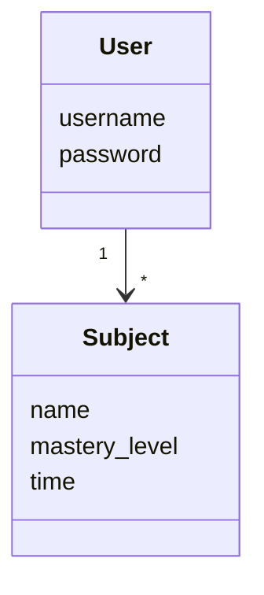
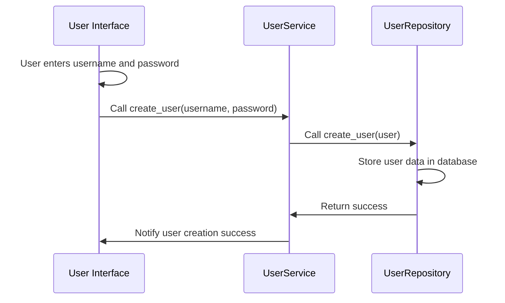

## Structure of the application

The following package diagram shows the general architecture of the application.

## User Interface
The UI has 7 views:
1. Login
2. Create account
3. Main page
4. View subjects
5. Add subject
6. Subject overview
7. Visualize subjects

These views all have their own classes, only one can be viewed at a time. There is a view manager that manages switching between the views. All of the UI is in it's own directory, separate from the application logic.

## Application logic
Under the directory Entities, there are the two classes that make up the base of the application: User and Subject.

Under the directory Repositories are the classes that handle interactions with the database: UserRepository and SubjectRepository. These classes provide methods for the application to interact with the database, ensuring a separation between application logic and database, as well as between the UI.

Under the directory Services are the classes that handle the main application logic: UserService and SubjectService. These classes provide methods that are used to manage the overall logic behind the user interacting with the app. The UserService class takes use of the UserRepository class to interact with the database when it comes to creations of users, logging in/out etc. The SubjectService takes use of the SubjectRepository class to interact with the database (adding, removing, viewing, editing subjects).

Here is a package diagram showing how the repositories and services work.

## Storage of data
As mentioned earlier, the UserRepository and SubjectRepository handle data storage and interaction with the database. The database in use in my application is the SQLite database, and it has two tables (for User and Subject).
As one would expect, the users table holds in it all of the info about the user (with username and password as attributes). The subjects table holds in it all the info about the subjects (with id, username, name, mastery_level, time as attributes).

## Functionalities
The current main functionalities are:

### Creating a user:
The user first from the main screen click on create user button. Then they are taken to a view, where they must input a username and a password. Here is the sequence diagram:

Sequence Diagram 

### Logging in a user:
Works very similarly to the create user. The user has to enter their credentials, and if they are correct, the user will be logged in and directed to a view of their subjects.

### Creating a new subject:
If user clicks on add subject, they will be directed to a screen where they can input the name and mastery level of a subject. When they click on submit, the UI calls the create_subject method from the SubjectService, giving it the name and mastery level as parameters. The create_subject method then makes sure that the subject name is not empty and a subject with the same name does not already exist. If that has been verified, then it calls the add_subject method from the SubjectRepository. That method will add a subject with the name and mastery level into the database, and the user will be given feedback of success (or failure if something was wrong at any step).
