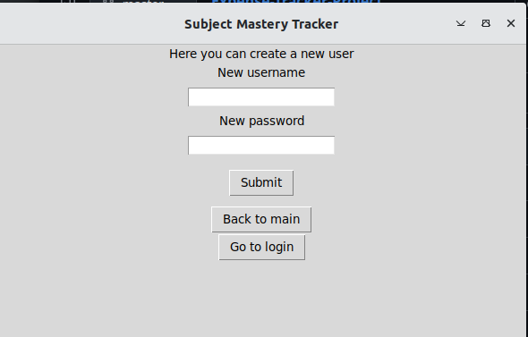
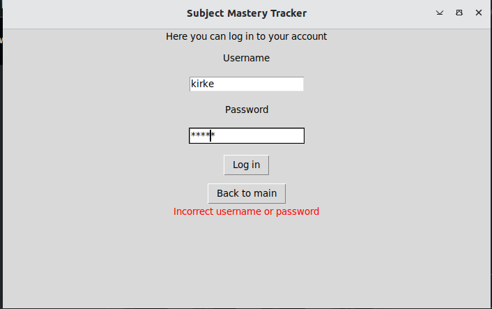
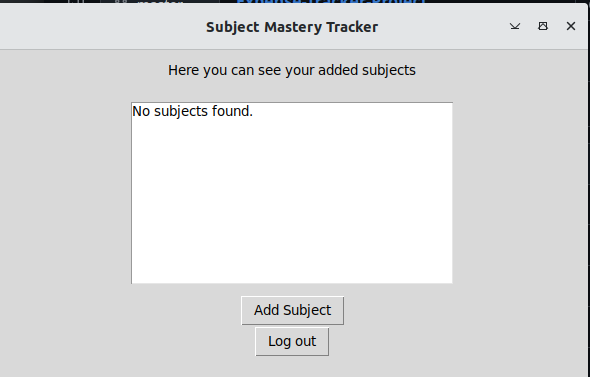
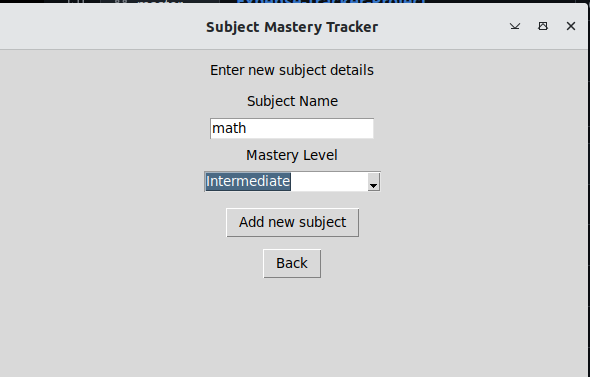

# User Manual

## Installation
```
poetry install
```
```
poetry run invoke initialize
```
```
poetry run invoke start
```
## Using the application
### Create user
When starting the application, user can choose to either click login or create user. If you do not have an account, you should first click on create user. When you have clicked on create user, this screen shows:


When you have put the credentials that you want, click submit. If creation was successful, a green success message will be displayed.

### Login user
Once you have created an account, you can click on go to login. Then, the following screen will show:


Put the credentials you used to create an account in here, in which case you will be logged in.

### Subjects view
After logging in, you will be shown your subjects (in the beginning, this will be empty):


### Add subject view
You can add a subject:



