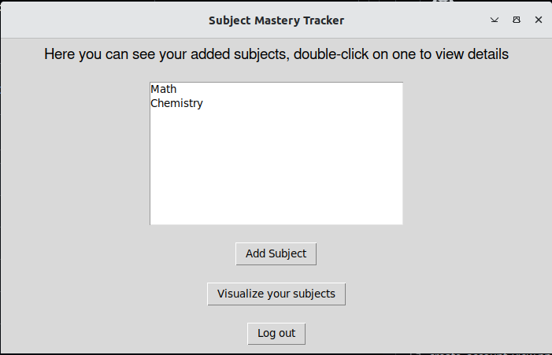

# User Manual

## Configuration
The name of the database file comes automatically from the .env file in the root directory. Inside this .env file, you can choose to change the filename.
This is the format of the database:
```
DATABASE_FILE=database.sqlite
```

## Installation
To install the dependencies (on command line)
```
poetry install
```
To initialize database and other important parts for the app
```
poetry run invoke initialize
```
To start the app
```
poetry run invoke start
```

## Using the application

### Create user
When starting the application, user can choose to either click login or create user. The first view is displayed like this:


If you do not have an account, you should first click on create user. When you have clicked on create user, this screen shows:


When you have put the credentials that you want, click submit. If creation was successful, a green success message will be displayed. If it was unsuccessful you will get a red error message and be prompted to try again. Reasons for not being successful: 
1. username already in use
2. 2. password either too short(<5 characters) or password consisted only of letters.

### Login user
Once you have created an account, you can click on go to login. Then, the following screen will show:


Put the credentials you used to create an account in here, in which case you will be logged in.

### Subjects view
After logging in, you will be shown your subjects (in the beginning, this will be empty):



From here, you can add a subject, go back to main menu, or visualize your subjects.

### Add subject view
You can add a subject:


When adding the subject you cannot leave the name empty, also you cannot have multiple of the same subject. After you've added a subject, you'll get a colored message telling you whether it was successful. Then you can add another one or go back.

### Subject info view
You can view info about subject and edit it:


Here, you can either change the mastery level, or add/remove hours logged working on this subject. You can't make the logged hours less than zero though (you will get another red error message). In this screen, you can also decide to delete a subject. If you click on this, it will open a pop-up window asking you to confirm deletion. You can click yes, or cancel.

### Visualize subjects view
You can see a graph about the subjects:


If you go here, you can see on the x-axis your subjects, and on the y-axis the number of hours logged in each of them. Then you can go back to the main subjects view.


