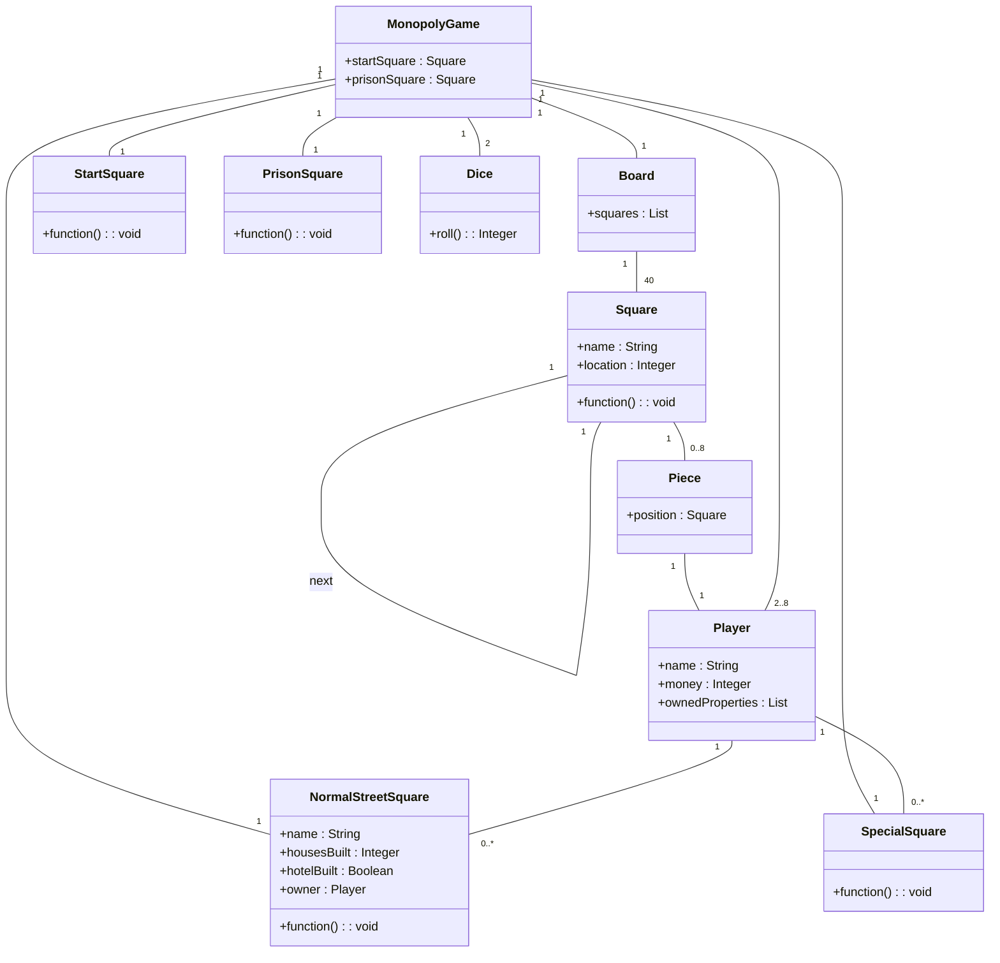

--- 
Monopoly
---

```mermaid
classDiagram
    class MonopolyGame {
        +startSquare : Square
        +prisonSquare : Square
    }

    class Board {
        +squares : List<Square>
    }

    class Square {
        +name : String
        +location : Integer
        +function() : void
    }

    class StartSquare {
        +function() : void
    }

    class PrisonSquare {
        +function() : void
    }

    class SpecialSquare {
        +function() : void
    }

    class NormalStreetSquare {
        +name : String
        +housesBuilt : Integer
        +hotelBuilt : Boolean
        +owner : Player
        +function() : void
    }

    class Player {
        +name : String
        +money : Integer
        +ownedProperties : List<Square>
    }

    class Dice {
        +roll() : Integer
    }

    class Piece {
        +position : Square
    }

    MonopolyGame "1" -- "2" Dice
    MonopolyGame "1" -- "1" Board
    Board "1" -- "40" Square
    Square "1" -- "1" Square : next
    Square "1" -- "0..8" Piece
    Piece "1" -- "1" Player
    Player "2..8" -- "1" MonopolyGame
    MonopolyGame "1" -- "1" StartSquare
    MonopolyGame "1" -- "1" PrisonSquare
    MonopolyGame "1" -- "1" SpecialSquare
    MonopolyGame "1" -- "1" NormalStreetSquare
    Player "1" -- "0..*" NormalStreetSquare
    Player "1" -- "0..*" SpecialSquare

```
