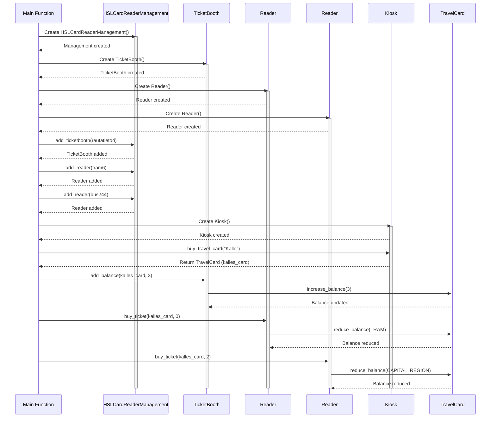

```mermaid
sequenceDiagram
    participant main as Main Function
    participant management as HSLCardReaderManagement
    participant rautatietori as TicketBooth
    participant tram6 as Reader
    participant bus244 as Reader
    participant kiosk1 as Kiosk
    participant kalles_card as TravelCard

    main->>management: Create HSLCardReaderManagement()
    activate management
    management-->>main: Management created

    main->>rautatietori: Create TicketBooth()
    activate rautatietori
    rautatietori-->>main: TicketBooth created

    main->>tram6: Create Reader()
    activate tram6
    tram6-->>main: Reader created

    main->>bus244: Create Reader()
    activate bus244
    bus244-->>main: Reader created

    main->>management: add_ticketbooth(rautatietori)
    management-->>main: TicketBooth added

    main->>management: add_reader(tram6)
    management-->>main: Reader added

    main->>management: add_reader(bus244)
    management-->>main: Reader added

    main->>kiosk1: Create Kiosk()
    activate kiosk1
    kiosk1-->>main: Kiosk created

    main->>kiosk1: buy_travel_card("Kalle")
    activate kalles_card
    kiosk1-->>main: Return TravelCard (kalles_card)

    main->>rautatietori: add_balance(kalles_card, 3)
    rautatietori->>kalles_card: increase_balance(3)
    kalles_card-->>rautatietori: Balance updated

    main->>tram6: buy_ticket(kalles_card, 0)
    tram6->>kalles_card: reduce_balance(TRAM)
    kalles_card-->>tram6: Balance reduced

    main->>bus244: buy_ticket(kalles_card, 2)
    bus244->>kalles_card: reduce_balance(CAPITAL_REGION)
    kalles_card-->>bus244: Balance reduced

    deactivate bus244
    deactivate tram6
    deactivate rautatietori
    deactivate management
    deactivate kiosk1

```
 
